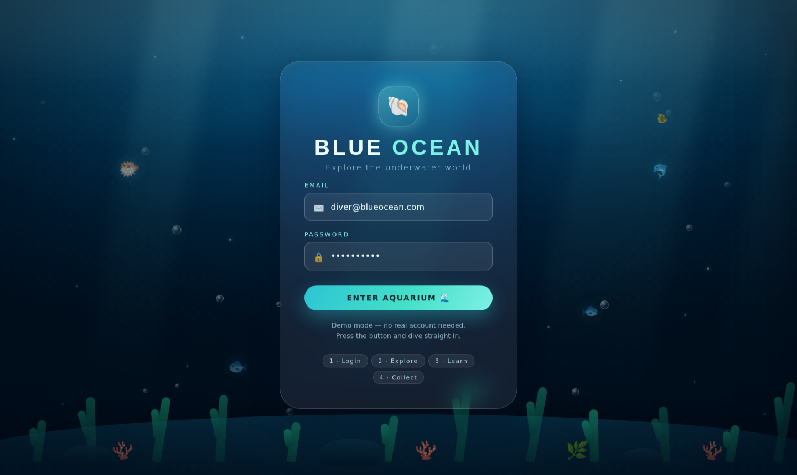
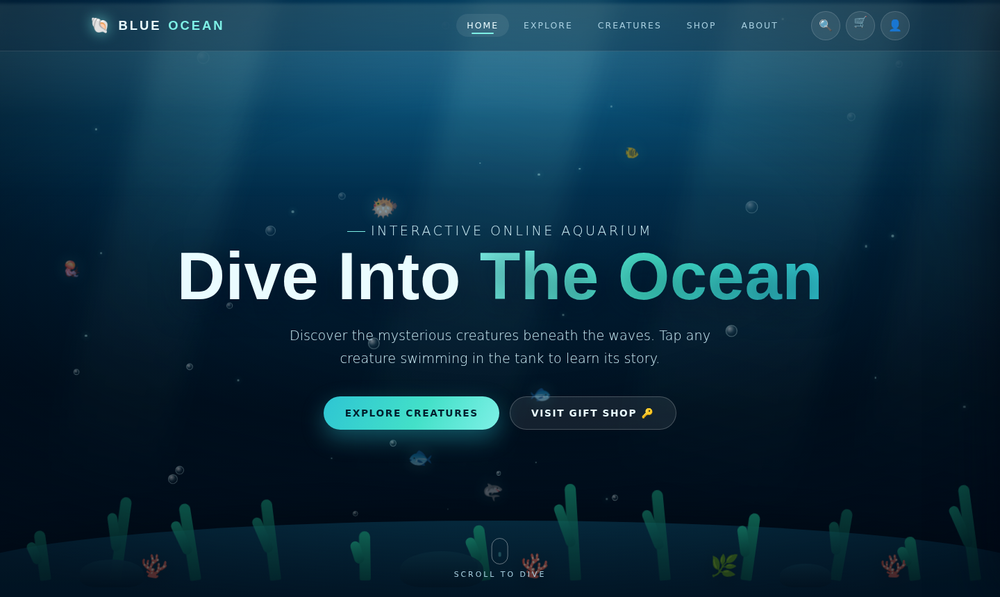
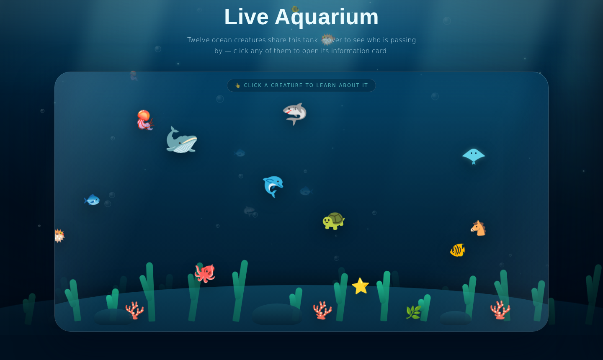
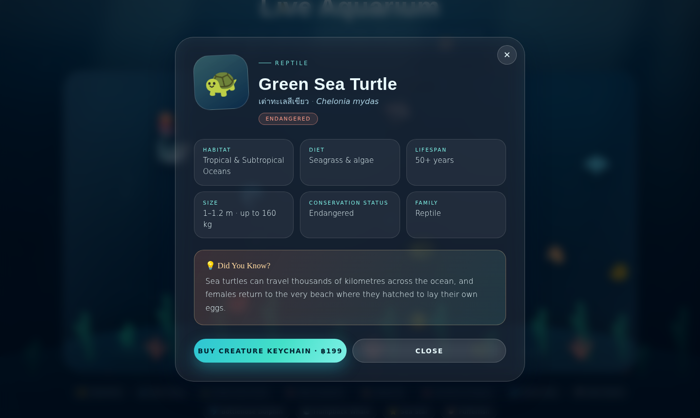
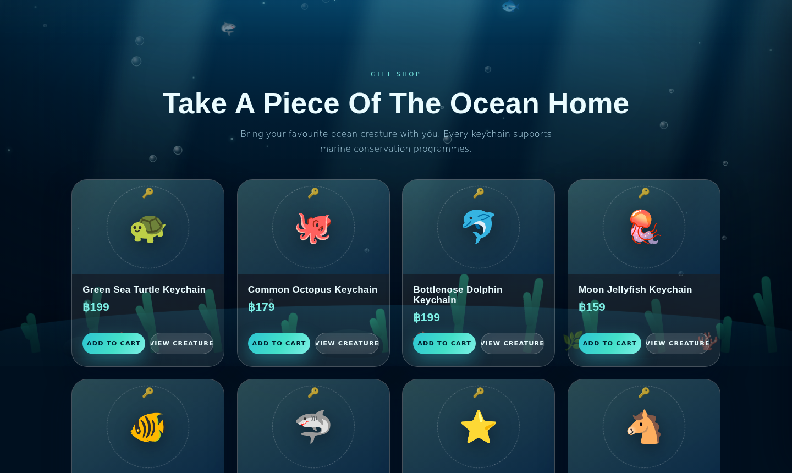
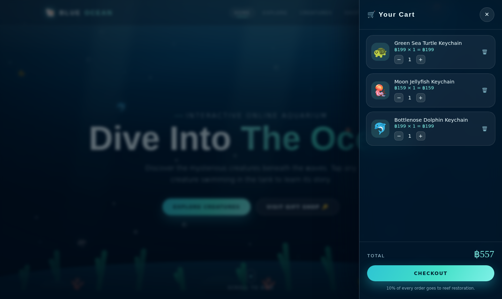

# Blue-Ocean
# 🌊 BLUE OCEAN — Interactive Online Aquarium

> **Explore. Learn. Protect.**
> เว็บไซต์อควาเรียมออนไลน์แบบ Interactive ที่ให้ผู้ใช้ "ดำน้ำ" เข้าไปสำรวจสัตว์ทะเล 12 ชนิด เรียนรู้ข้อมูลของแต่ละตัว และซื้อพวงกุญแจรูปสัตว์ทะเลกลับบ้าน

<p align="center">
  
  
  
  
  
</p>

<p align="center">
  
</p>

---

## 📖 About The Project · เกี่ยวกับโปรเจกต์

**Blue Ocean** ไม่ใช่เว็บไซต์ข้อมูลแบบ static ทั่วไป แต่ถูกออกแบบให้ผู้ใช้รู้สึกเหมือนกำลัง *เดินสำรวจอควาเรียมจริง* — มีปลาว่ายผ่านหน้าจอ ฟองอากาศลอยขึ้นจากพื้นทราย แสงจากผิวน้ำส่องลงมา และสาหร่ายที่ไหวตามกระแสน้ำ

ผู้ใช้สามารถ **คลิกสัตว์ทะเลที่กำลังว่ายอยู่** เพื่อเปิดการ์ดข้อมูล เรียนรู้ถิ่นอาศัย อาหาร อายุขัย และสถานะการอนุรักษ์ จากนั้นสั่งซื้อพวงกุญแจของสัตว์ตัวนั้นได้ทันทีจากใน Modal

The entire project lives in **one single `index.html` file** — no frameworks, no build tools, no backend. Just open it in a browser.

### ✨ Highlights

| | |
|---|---|
| 🐠 **12 clickable sea creatures** | แต่ละตัวมีตำแหน่ง ความเร็ว และรูปแบบการเคลื่อนไหวของตัวเอง |
| 🔍 **Search & category filter** | ค้นหาได้ทั้งชื่ออังกฤษ ชื่อไทย ชื่อวิทยาศาสตร์ และถิ่นอาศัย |
| 🛒 **Full shopping cart** | เพิ่ม/ลด/ลบสินค้า คำนวณราคารวม และ Checkout จำลอง |
| 💎 **Glassmorphism UI** | Navigation, Card, Modal และ Cart ใช้ backdrop blur ทั้งหมด |
| 📱 **Fully responsive** | ทดสอบแล้วตั้งแต่จอ 390px จนถึง Desktop 1440px+ |
| ⚡ **Zero dependencies** | ไม่มีรูปจากภายนอกเลย ใช้ CSS / SVG / Emoji ทั้งหมด ทำงานได้แม้ออฟไลน์ |

---

## 🖼️ Screenshots · ภาพหน้าจอ

| Login Page | Hero Section |
|:---:|:---:|
|  |  |
| หน้าล็อกอินธีมใต้ทะเล + Glassmorphism card | Hero พร้อม fade-in animation |

| Live Aquarium Tank | Creature Modal |
|:---:|:---:|
|  |  |
| ตู้ปลาหลัก คลิกสัตว์ได้ทุกตัว | การ์ดข้อมูลสัตว์ + Did You Know |

| Keychain Shop | Shopping Cart |
|:---:|:---:|
|  |  |
| ร้านขายพวงกุญแจ 8 แบบ | Cart แบบ Slide-in Sidebar |

---

### 🔑 Demo Login

หน้าล็อกอินเป็นการ **จำลอง** ไม่มีการตรวจสอบจริงและไม่มีการเก็บข้อมูลใด ๆ

| Field | Value |
|---|---|
| Email | `diver@blueocean.com` *(กรอกไว้ให้แล้ว)* |
| Password | `oceanlover` *(กรอกไว้ให้แล้ว)* |

กดปุ่ม **ENTER AQUARIUM** ได้ทันที

---

## 🐙 Creature Database · ฐานข้อมูลสัตว์ทะเล

สัตว์ทั้ง 12 ชนิดถูกเก็บเป็น JavaScript object array ในตัวแปร `CREATURES` — เพิ่มสัตว์ใหม่ได้ง่ายเพียงเพิ่ม object ใหม่เข้าไป 1 ตัว

| # | Creature | ชื่อไทย | Category | Habitat | Keychain | Shop |
|:--:|---|---|---|---|--:|:--:|
| 1 | 🐠 Clownfish | ปลาการ์ตูน | Fish | Coral Reefs | ฿149 | ✅ |
| 2 | 🐟 Blue Tang | ปลาแท็งก์สีน้ำเงิน | Fish | Indo-Pacific Reefs | ฿149 | — |
| 3 | 🐢 Green Sea Turtle | เต่าทะเลสีเขียว | Reptile | Tropical Oceans | ฿199 | ✅ |
| 4 | 🪼 Moon Jellyfish | แมงกะพรุนพระจันทร์ | Invertebrate | Oceans worldwide | ฿159 | ✅ |
| 5 | 🐴 Seahorse | ม้าน้ำ | Fish | Seagrass & Reefs | ฿169 | ✅ |
| 6 | 🐙 Common Octopus | ปลาหมึกยักษ์ | Invertebrate | Oceans worldwide | ฿179 | ✅ |
| 7 | 🛸 Manta Ray | ปลากระเบนราหู | Fish | Tropical & Temperate | ฿189 | — |
| 8 | 🦈 Reef Shark | ฉลามครีบดำ | Fish | Shallow Reefs | ฿199 | ✅ |
| 9 | 🐬 Bottlenose Dolphin | โลมาปากขวด | Mammal | Temperate Seas | ฿199 | ✅ |
| 10 | 🐋 Humpback Whale | วาฬหลังค่อม | Mammal | All major oceans | ฿219 | — |
| 11 | ⭐ Sea Star | ปลาดาว | Invertebrate | Seabed & Tide Pools | ฿129 | ✅ |
| 12 | 🐡 Pufferfish | ปลาปักเป้า | Fish | Warm Coastal Waters | ฿159 | — |

> คอลัมน์ **Shop** = สินค้าที่แสดงในหน้าร้าน (8 รายการ) ส่วนสัตว์ที่เหลือยังสั่งซื้อได้จากปุ่ม **BUY CREATURE KEYCHAIN** ใน Modal ของสัตว์ตัวนั้น

ข้อมูลของสัตว์แต่ละตัวประกอบด้วย:

```js
{
  id: 'turtle',
  name: 'Green Sea Turtle',
  thai: 'เต่าทะเลสีเขียว',
  sci:  'Chelonia mydas',
  emoji: '🐢',
  cat: 'reptile',              // fish | mammal | reptile | invertebrate
  price: 199,
  habitat: 'Tropical & Subtropical Oceans',
  diet: 'Seagrass & algae',
  lifespan: '50+ years',
  size: '1–1.2 m · up to 160 kg',
  status: 'Endangered',
  statusClass: 'danger',       // safe | warn | danger
  fact: 'Sea turtles can travel thousands of kilometres…',
  motion: 'swim',              // swim | float | bed
  top: 55, dur: 38, dir: 'ltr', size2: '3rem'
}
```

## ⚙️ Features Checklist · ฟีเจอร์ทั้งหมด

### Animation & Atmosphere

- [x] **Fish swimming** — ว่ายซ้าย→ขวา และขวา→ซ้าย ด้วยความเร็วต่างกัน (15s – 38s)
- [x] **Bubble animation** — ฟองอากาศ 26 ฟองสุ่มขนาด/ความเร็ว ลอยขึ้นจากพื้น
- [x] **Jellyfish float** — ลอยขึ้นลงช้า ๆ พร้อมหมุนเล็กน้อย
- [x] **Light rays** — แสง 5 ลำจากผิวน้ำ เอียงไปมาแบบ mix-blend-mode: screen
- [x] **Seaweed sway** — สาหร่าย 12 ต้นไหวไม่พร้อมกัน
- [x] **Water particles** — แพลงก์ตอน 42 จุดลอยขึ้นช้า ๆ
- [x] **Parallax scroll** — พื้นหลัง / ฝูงปลา / แสง เคลื่อนที่คนละความเร็ว
- [x] **Scroll reveal** — เนื้อหา fade-in เมื่อเลื่อนถึง (IntersectionObserver)
- [x] **Animated counters** — ตัวเลขสถิติวิ่งขึ้นด้วย cubic ease-out

### Interaction

- [x] Login transition (ซูม + เบลอ เหมือนดำดิ่งลงน้ำ)
- [x] Hover สัตว์ → ขยาย + เรืองแสง + แสดงชื่อ + เปลี่ยน cursor
- [x] Click สัตว์ → animation เด้ง แล้วเปิด Modal
- [x] รองรับคีย์บอร์ด (`Tab` / `Enter` / `Space` / `Esc`)
- [x] Search แบบ real-time + Filter 5 หมวด
- [x] Add to cart พร้อม emoji บินเข้าตะกร้า + Toast แจ้งเตือน
- [x] เพิ่ม / ลด / ลบสินค้า และคำนวณราคารวมอัตโนมัติ
- [x] Checkout Modal พร้อมใบเสร็จจำลอง
- [x] Mobile burger menu + Scroll spy ไฮไลต์เมนูอัตโนมัติ

---

## 📁 Project Structure · โครงสร้างโปรเจกต์

```
blue-ocean-aquarium/
├── index.html          ← ทั้งเว็บไซต์อยู่ในไฟล์นี้ไฟล์เดียว (HTML + CSS + JS)
├── README.md
└── docs/
    └── screenshots/    ← ภาพหน้าจอสำหรับ README
        ├── login.png
        ├── hero.png
        ├── tank.png
        ├── modal.png
        ├── shop.png
        └── cart.png
```

### ภายใน `index.html`

โค้ดถูกแบ่ง section พร้อมสารบัญและคอมเมนต์กำกับทุกส่วน เพื่อให้อ่านและแก้ไขง่าย

```
<style>                    <script>
 01. Design tokens & reset   A. Creature dataset
 02. Reusable UI             B. Helpers
 03. Ocean background        C. Ambient ocean
 04. Login screen            D. Login transition
 05. Navigation              E. Navigation & parallax
 06. Hero                    F. Interactive tank
 07. Aquarium tank           G. Search & filter
 08. Explore grid            H. Creature modal
 09. Shop                    I. Keychain shop
 10. Conservation            J. Cart & checkout
 11. Footer                  K. Counters & reveal
 12. Modals
 13. Cart & toast
 14. Responsive
```

---

## 🛠️ Tech Stack · เทคโนโลยีที่ใช้

| Technology | Usage |
|---|---|
| **HTML5** | Semantic markup, ARIA attributes |
| **CSS3** | Custom Properties, Grid, Flexbox, `backdrop-filter`, Keyframe Animations |
| **Vanilla JavaScript (ES6+)** | ไม่มี framework / library ใด ๆ |
| **IntersectionObserver API** | Scroll reveal และ animated counters |
| **Google Fonts** | Baloo 2 + Outfit (มี fallback ในกรณีโหลดไม่ได้) |
| **Emoji + Inline SVG** | ใช้แทนรูปภาพทั้งหมด ไม่ต้องพึ่ง CDN รูปภาพ |

**ไม่ใช้:** React · Bootstrap · jQuery · npm · Backend · Database

---

## 🌍 Browser Support · เบราว์เซอร์ที่รองรับ

| Browser | Version |
|---|---|
| Chrome / Edge | 90+ |
| Firefox | 88+ |
| Safari | 15+ (iOS 15+) |

> ใช้ `backdrop-filter` ซึ่งรองรับในเบราว์เซอร์รุ่นใหม่ทั้งหมด หากเปิดในเบราว์เซอร์เก่า UI จะยังใช้งานได้ปกติเพียงแต่ไม่มีเอฟเฟกต์เบลอ
> รองรับ `prefers-reduced-motion` — ผู้ใช้ที่ตั้งค่าลดการเคลื่อนไหวในระบบจะเห็นเว็บแบบไม่มี animation

---

## 🔧 Customization · การปรับแต่ง

<details>
<summary><b>เพิ่มสัตว์ทะเลตัวใหม่</b></summary>

เพิ่ม object เข้าไปใน array `CREATURES` (ส่วน A ของ `<script>`) — ตู้ปลา การ์ด และระบบค้นหาจะอัปเดตให้อัตโนมัติ

```js
{
  id: 'crab', name: 'Coconut Crab', thai: 'ปูมะพร้าว', sci: 'Birgus latro',
  emoji: '🦀', cat: 'invertebrate', price: 139,
  habitat: 'Tropical Islands', diet: 'Fruits & nuts',
  lifespan: '60 years', size: 'Up to 1 m',
  status: 'Vulnerable', statusClass: 'warn',
  fact: 'The coconut crab is the largest land-living arthropod in the world.',
  motion: 'bed', top: 78, left: 45, size2: '2.4rem'
}
```
</details>

<details>
<summary><b>เพิ่มสินค้าในร้าน</b></summary>

เพิ่ม `id` ของสัตว์เข้าไปใน array `SHOP_IDS`

```js
const SHOP_IDS = ['turtle', 'octopus', 'dolphin', 'jellyfish',
                  'clownfish', 'shark', 'starfish', 'seahorse', 'crab'];
```
</details>

<details>
<summary><b>เปลี่ยนโทนสีทั้งเว็บ</b></summary>

แก้ค่าใน `:root` ส่วนบนสุดของ `<style>` เพียงจุดเดียว สีจะเปลี่ยนทั้งเว็บไซต์

```css
:root {
  --aqua: #2ec5d3;
  --cyan: #7ef0e6;
  --coral: #ff8a6b;
}
```
</details>

<details>
<summary><b>ปรับความเร็วการว่ายของสัตว์</b></summary>

แก้ค่า `dur` (วินาทีต่อ 1 รอบ) ในข้อมูลสัตว์ — ยิ่งมากยิ่งว่ายช้า

```js
motion: 'swim', top: 55, dur: 38, dir: 'ltr'
//                        ↑ เต่าใช้ 38 วินาที ปลาการ์ตูนใช้ 15 วินาที
```
</details>

---

## 🐚 Credits

- ข้อมูลสัตว์ทะเลอ้างอิงจากแหล่งความรู้ทางทะเลทั่วไป จัดทำเพื่อการศึกษา
- สถานะการอนุรักษ์อ้างอิงแนวทางของ IUCN Red List
- Emoji artwork rendered by the user's operating system
- สร้างขึ้นเพื่อเป็น **Portfolio Project** ด้าน Frontend Development

---

<p align="center">
  <b>🌊 Explore. Learn. Protect. 💙</b><br>
  <sub>© 2026 Blue Ocean Aquarium</sub>
</p>
